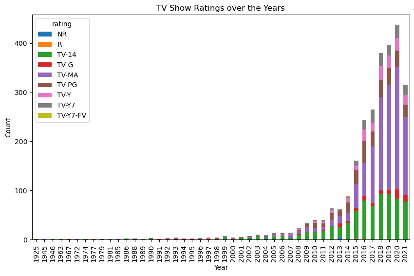
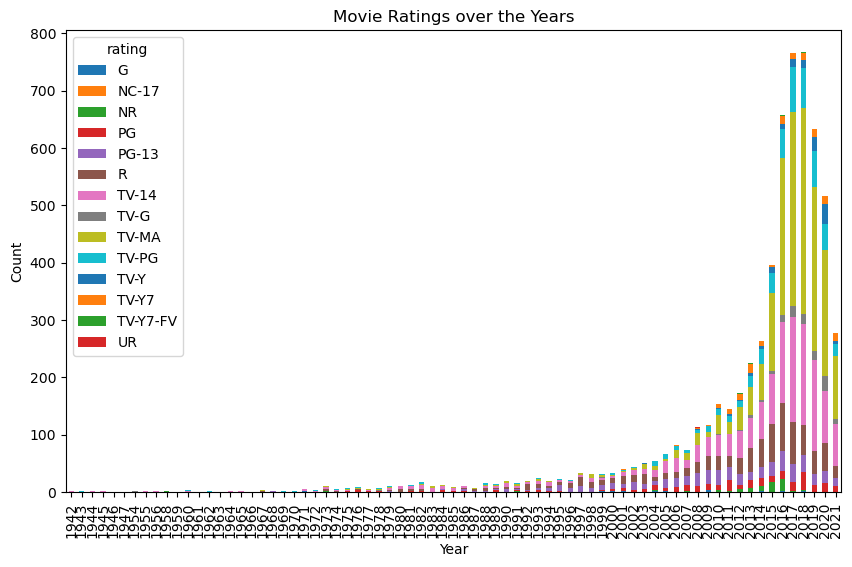

# Netflix Movie and TV Shows Project Overview

## About the Project
The purpose of this project is to generate descriptive statistics and look into trends of movie and TV show releases on Netflix over the years. 

### Summary Statistics of Movie and TV Show Release Years:
<table border="1" class="dataframe">
  <thead>
    <tr style="text-align: right;">
      <th></th>
      <th>release_year</th>
    </tr>
  </thead>
  <tbody>
    <tr>
      <th>count</th>
      <td>8807.000000</td>
    </tr>
    <tr>
      <th>mean</th>
      <td>2014.180198</td>
    </tr>
    <tr>
      <th>std</th>
      <td>8.819312</td>
    </tr>
    <tr>
      <th>min</th>
      <td>1925.000000</td>
    </tr>
    <tr>
      <th>25%</th>
      <td>2013.000000</td>
    </tr>
    <tr>
      <th>50%</th>
      <td>2017.000000</td>
    </tr>
    <tr>
      <th>75%</th>
      <td>2019.000000</td>
    </tr>
    <tr>
      <th>max</th>
      <td>2021.000000</td>
    </tr>
  </tbody>
</table>

### Visualizations

## Note on the repository and directions:
This project contains:
* requirements.txt detailing the requirements needed for this project
* Makefile to install requirements, lint, format, and test your code
* github actions and successful CI/CD badges
* DockerFile and devcontainer for environment set up
* Jupyter notebook performing descriptive statistics & tested with nbval plugin
* main.py Python script for statistics and generating data visualizations
* Summary pdf or markdown file
* test_main.py for Python testing scripts

## Preparation
1. Open codespaces 
2. Load repo to code spaces
2. Wait for installation of all requirements in requirements.txt

## Check format and test errors
1. Format code `make format`

2. Lint code `make lint`

3. Test code `make test`

(alternatively, do all with `make all`)

